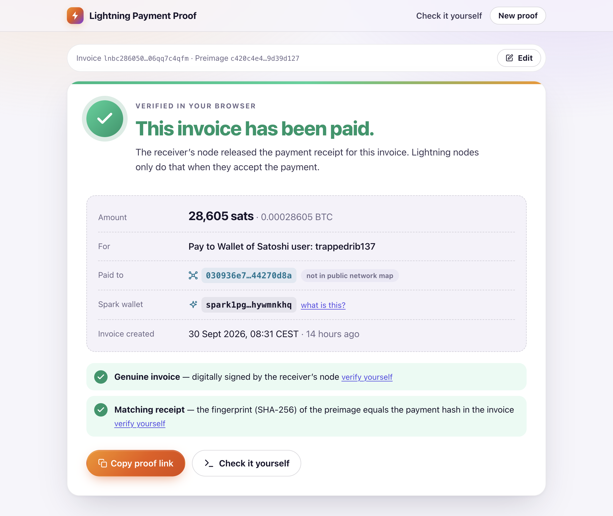
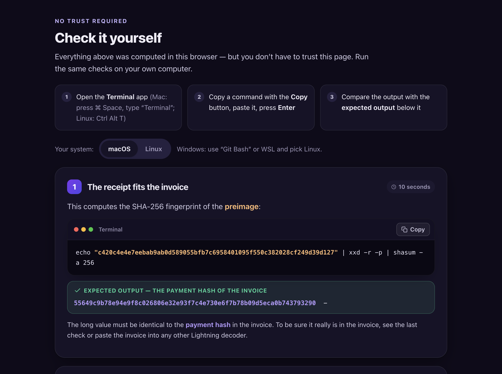

<h1 align="center">⚡ Lightning Payment Proof</h1>

<p align="center">
  <b>Prove that a Bitcoin Lightning invoice was paid — with a single link.</b><br>
  Verified in the browser · explained in plain words · checkable in your own terminal
</p>

<p align="center">
  <a href="https://ln-payment-proof.utxo.at"><b>Try it: ln-payment-proof.utxo.at</b></a>
  &nbsp;·&nbsp;
  <a href="DESIGN.md">Design notes</a>
  <br><br>
  <a href="https://github.com/johnzweng/ln-payment-proof/actions/workflows/test.yml"></a>
  
  <a href="LICENSE"></a>
</p>

<p align="center">
  
</p>

## The problem

You paid a Lightning invoice. The receiver says the money never arrived.

Your wallet has the proof, the **preimage**. But a 64-character hex string convinces nobody who
doesn't know what a preimage is.

This page turns **invoice + preimage** into one link:

```
https://ln-payment-proof.utxo.at/?bolt11=lnbc…&preimage=…
```

Whoever opens it sees whether the invoice was paid, why that counts as proof, and how to check it themselves.

## How the proof works

| Step | What happens | What the page checks |
|------|--------------|----------------------|
| 1. Invoice | The receiver's node picks a secret *preimage* and **signs** an invoice containing its fingerprint, the *payment hash*. | The signature is valid → the invoice is genuine. |
| 2. Payment | The money travels through the network, locked to the payment hash. | — |
| 3. Receipt | To take the money, the receiver's node must reveal the preimage. It travels back to the payer. | `SHA-256(preimage) == payment hash` → the receiver's node released it. |

Nobody can compute a preimage from a hash. So a matching preimage means the receiver's node
accepted the payment. [DESIGN.md §3](DESIGN.md#3-what-the-proof-proves-the-trust-model)
covers exactly what this proves and what it doesn't.

## Features

- **Private.** Everything is computed in your browser. Invoice and preimage are never uploaded.
- **Plain words.** A clear verdict first, then a one-minute explanation for non-experts.
- **No trust required.** Copy-paste commands for macOS and Linux repeat every check with
  `shasum`, `openssl` and a short Python script that uses only the standard library.
- **Receiver details.** Node id, explorer links and route hints, plus an explanation of why a
  private node is still a valid proof.
- **Spark wallets** are recognized, and their Spark address is shown.
- **Zero dependencies.** No build step, no frameworks, no trackers, no external fonts.

<details>
<summary><b>Screenshot: “Check it yourself” (dark mode)</b></summary>
<br>

</details>

## Run it locally

```sh
git clone https://github.com/johnzweng/ln-payment-proof.git
cd ln-payment-proof
python3 -m http.server 8000 --directory public
```

Open <http://localhost:8000> and click **Try an example**.
Any static web server works. Opening `index.html` directly (`file://`) does not, because browsers don't load JavaScript modules from files.

## Deploy

The whole app is the `public/` folder: static files, no backend. Serve it with the included
nginx config, which sets the security headers and **keeps proof data out of the access log**.

**With Docker:**

```sh
docker run -d --name ln-payment-proof --restart unless-stopped -p 8080:80 \
  -v "$PWD/public:/usr/share/nginx/html:ro" \
  -v "$PWD/deploy/nginx.conf:/etc/nginx/conf.d/default.conf:ro" \
  nginx:alpine
```

**On an existing nginx:**

1. Copy `public/` to your server, e.g. `/var/www/ln-payment-proof`.
2. Copy [`deploy/nginx.conf`](deploy/nginx.conf) to `/etc/nginx/conf.d/` and set `server_name` and `root`.
3. Run `nginx -t && nginx -s reload`.

Add HTTPS in front (e.g. Let's Encrypt or your reverse proxy).
**Updating** means replacing the files. No restart is needed, and browsers pick up changes immediately (`Cache-Control: no-cache`).

> [!IMPORTANT]
> Proof links carry the invoice and preimage in the query string. If you use another server or
> put a proxy in front, make sure its access log doesn't record query strings. Also set a
> Content-Security-Policy like the one in `deploy/nginx.conf`.

## Project layout

```
public/                      ← the website: deploy this folder
├── index.html
└── assets/
    ├── app.js               entry point: input form and routing
    ├── app.css
    ├── lnproof/             verification library (no DOM, also runs in Node.js)
    │   ├── index.js         public API
    │   ├── proof.js         verifyProof(): signature + SHA-256(preimage) == payment hash
    │   ├── bolt11.js        invoice decoding and signature check
    │   ├── bech32.js  sha256.js  secp256k1.js  bytes.js
    │   ├── spark.js         Spark wallet detection
    │   └── known-nodes.js   labelled nodes (primary sources only)
    ├── ui/                  DOM helpers, formatting, node lookups
    │   └── views/           one file per page section
    └── verify_invoice.py    independent decoder offered on the page
deploy/nginx.conf            reference web server config
test/                        tests (node:test, python3 + openssl)
DESIGN.md                    requirements and design decisions
```

The library can be used on its own:

```js
import { verifyProof } from './public/assets/lnproof/index.js';

const proof = verifyProof(invoice, preimage);
proof.proven;          // true: valid signature and matching preimage
proof.invoice.nodeId;  // the receiver's node
```

## Tests

```sh
./test/run-tests.sh      # or: npm test
```

Needs Node.js ≥ 20, `python3` and `openssl`. The tests cover the BOLT #11 spec vectors, a
real-world invoice, the Spark SDK vectors, SHA-256 known answers, and the Python + openssl path
offered on the page.

## Privacy

- **In the browser:** decoding and every check run locally.
- **Third parties:** the only external request goes to
  `mempool.space/api/v1/lightning/nodes/<pubkey>`, to show node names. It sends public keys
  only, with no cookies and no referrer.
- **The web server** receives the query string of `?bolt11=…&preimage=…` links; the included
  config doesn't log it. For links that never reach any server, use a fragment:
  `#bolt11=…&preimage=…`.

## Contributing

Issues and pull requests are welcome. Please run the tests, and keep the three ground rules:
no dependencies, no build step, and labels in `known-nodes.js` only with a primary source.

## License

[MIT](LICENSE) © Johannes Zweng
